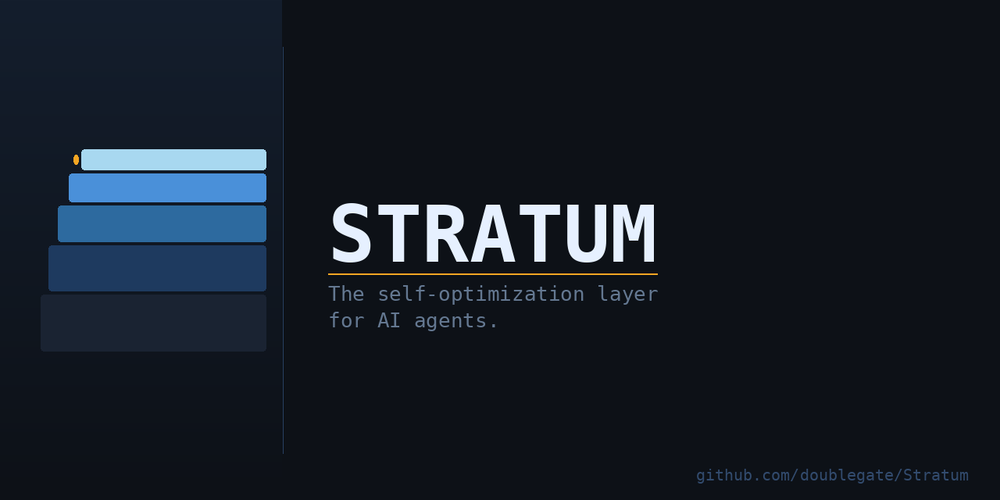
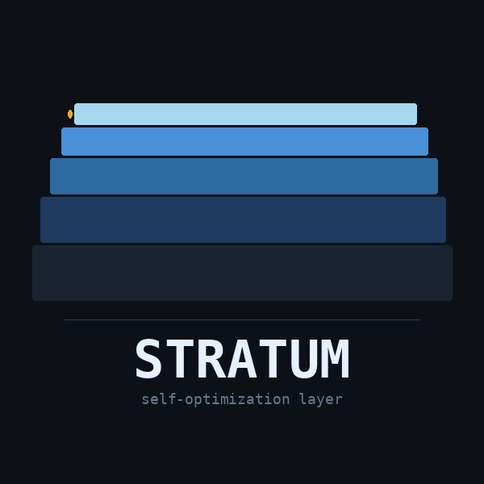

<div align="center">



[](LICENSE)
[](https://github.com/openclaw/openclaw)
[](https://www.rust-lang.org/)
[](https://www.python.org/)

</div>

---

Stratum gives your [OpenClaw](https://github.com/openclaw/openclaw) agent a spine.

Out of the box, AI agents are stateless — each session starts cold, with no memory of what worked, what failed, or what you care about. Stratum fixes that. It adds persistent memory, a structured knowledge graph, semantic search, cron health monitoring, a goal tree, and a continuous self-optimization loop — wired together and running in the background whether you're there or not.

Install it once. Your agent gets better every session.

---

## What Stratum Is

Stratum is **infrastructure**, not an agent. It sits beneath your OpenClaw agent and makes it meaningfully more capable:

| Without Stratum | With Stratum |
|---|---|
| Agent forgets everything on restart | Persistent memory across sessions |
| No structured knowledge | Knowledge graph with entities, beliefs, relations |
| Logs go nowhere | Semantic search over all past sessions + reports |
| Cron jobs fail silently | Health monitoring with auto-alerting |
| Goals live only in prompts | Persistent goal tree with evaluation history |
| Errors repeat session to session | Lesson system captures and surfaces past mistakes |
| No continuity between hosts | Dual-host failover with live sync |

---

## Architecture

<div align="center">

</div>

```
┌─────────────────────────────────────────────────────────┐
│                   Your OpenClaw Agent                   │
└────────────────────────┬────────────────────────────────┘
                         │ heartbeat / cron triggers
┌────────────────────────▼────────────────────────────────┐
│              stratum-brain  [Integration Hub]           │
│   aggregates all modules · hybrid FTS5 search           │
│   belief decay · graph traversal · nightly consolidation│
└──┬──────┬──────┬──────┬──────┬──────┬──────┬───────┬────┘
   │      │      │      │      │      │      │       │
  mind  watch  ops  contin  reports agent  boot    lens
[Rust] [Rust] [Rust] [Py]    [Py]  [Rust] [Rust]   [Py]
   │      │      │                                   │
mind.db watch.db ops.db                           ChromaDB
    (unified SQLite)                         (vector index)
```

**9 core modules:**

| Module | Language | Purpose |
|--------|----------|---------|
| `stratum-mind` | Rust | Lessons, stash notes, goals, knowledge graph, memory tiers |
| `stratum-watch` | Rust | Cron health, context window monitoring, version drift |
| `stratum-ops` | Rust | Privileged op queue, preflight checks, cron cleanup |
| `stratum-continuity` | Python | Session snapshots, drift analysis, primer injection |
| `stratum-reports` | Python | Document ingest, validation, timeline tracking |
| `stratum-agent-monitor` | Rust | Coding agent session monitoring and nudging |
| `stratum-boot-health` | Rust | Secure Boot, MOK, DKMS signing verification |
| `stratum-brain` | Python | Integration hub — aggregates all modules |
| `stratum-lens` | Python | Semantic search over workspace + all module feeds |

---

## Quick Start

### Prerequisites

- [OpenClaw](https://github.com/openclaw/openclaw) installed and configured
- Rust toolchain (`rustup` — stable + nightly)
- Python 3.11+ with [`uv`](https://github.com/astral-sh/uv)
- Node.js 20+ (via `fnm` recommended)
- `sqlite3` CLI

### Install

```bash
git clone https://github.com/doublegate/stratum
cd stratum
./install.sh
```

The installer will:
1. Prompt for your name, workspace path, and Telegram chat ID
2. Build all Rust modules and install binaries to `~/.local/bin/`
3. Install Python modules via `uv`
4. Copy persona templates to your workspace
5. Seed the canonical cron set into OpenClaw
6. Initialize the unified databases
7. Run a preflight check

**Total time: ~10–20 minutes** (mostly Rust compilation on first run).

### First Run

After install, in your OpenClaw workspace:

```bash
stratum-brain status        # full ecosystem health check
stratum-brain heartbeat     # run the heartbeat integration loop
stratum-mind lesson list    # view lesson DB (empty at first)
stratum-lens query "test"   # verify semantic index is live
```

---

## Configuration

Stratum uses a single config file at `~/.stratum/config.json`. The installer creates this from `config/examples/config.example.json`.

**Key settings:**

```json
{
  "user": {
    "name": "Your Name",
    "timezone": "America/New_York"
  },
  "paths": {
    "workspace": "~/clawd",
    "data": "~/.local/share/stratum",
    "bin": "~/.local/bin"
  },
  "modules": {
    "lens": { "auto_scale_threshold": 0.85 },
    "brain": { "consolidation_hour": 3 },
    "continuity": { "snapshot_interval_hours": 2 }
  }
}
```

Full reference: [`docs/configuration.md`](docs/configuration.md)

---

## Persona Templates

Stratum ships with sanitized templates for the OpenClaw workspace files that power your agent's identity and behavior:

| Template | Purpose |
|----------|---------|
| `templates/SOUL.md` | Agent character, values, working style |
| `templates/AGENTS.md` | Operational rules, memory habits, safety |
| `templates/USER.md` | Who you are — the agent learns from this |
| `templates/HEARTBEAT.md` | What the agent checks and does proactively |
| `templates/MEMORY.md` | Structured long-term memory scaffold |

Edit these after install. They're yours — Stratum just gives you a solid starting point.

---

## Cron Jobs

Stratum installs a set of canonical background jobs into OpenClaw. See [`crons/README.md`](crons/README.md) for the full list. Highlights:

| Job | Schedule | What it does |
|-----|----------|-------------|
| Knowledge Consolidation | 3:00 AM daily | Decays old beliefs, runs FTS5 rebuild |
| Weekly Self-Reflection | Sunday 2:00 AM | Reviews lessons, updates memory |
| World Model Sync | 3:15 AM daily | Updates dynamic beliefs from project state |
| Continuity Checkpoint | Every 2 hours | Snapshots session state, checks for drift |
| Boot Health Check | On boot | Verifies Secure Boot, MOK, DKMS signing |

---

## Module Reference

Full documentation for each module lives in `modules/<name>/README.md`.

Quick reference:

```bash
# Knowledge & memory
stratum-mind lesson learn "what you learned" --category correction
stratum-mind lesson list --severity high
stratum-mind stash add "note to remember"
stratum-mind goals list --tree
stratum-mind world query "entity name"
stratum-mind memory weekly         # memory tier health check

# Observability
stratum-watch status               # cron health + context monitor
stratum-watch version check        # drift detection

# Operations
stratum-ops queue add "sudo cmd" --reason "why" --elevated
stratum-ops status

# Brain (hub)
stratum-brain heartbeat            # run all integrations
stratum-brain status               # full dashboard
stratum-brain query "topic"        # semantic search across all modules
stratum-brain analyze              # pattern analysis + recommendations

# Semantic search
stratum-lens query "what happened with X"
stratum-lens index                 # rebuild index

# Continuity
stratum-continuity status
stratum-continuity primer --check  # session start injection
stratum-continuity checkpoint      # manual snapshot
```

---

## Patterns

[`patterns/`](patterns/) contains reusable multi-agent orchestration patterns developed alongside Stratum:

- **STATE.yaml** — Shared state file pattern for coordinating multiple coding agents without race conditions ([`patterns/multi-agent/STATE.md`](patterns/multi-agent/STATE.md))

---

## Security Notes

- Stratum stores all data locally. Nothing leaves your machine.
- Secrets are **never** stored in Stratum config files. Use your agent's secret provider (OpenClaw's `secrets.json` with file-based provider) for API keys.
- The `stratum-boot-health` module is optional and x86_64 Linux only. Skip it on other platforms.
- The privileged op queue (`stratum-ops`) requires manual `--elevated` approval. Nothing runs with sudo automatically.

---

## Project Status

Stratum is **production-stable** for personal use. It runs 24/7 on an active OpenClaw instance with 42 cron jobs and has been doing so continuously since early 2026.

It is **not** a polished consumer product. Expect to read source code. Expect to adapt things to your setup. The install script handles the common case; your mileage will vary on unusual configurations.

Issues and PRs welcome. This is a one-person infrastructure project — responses may be slow.

---

## License

MIT. Do what you want with it.

---

<div align="center">
<br/>
<sub><i>Named for what makes complex systems stable — the layer you don't see.</i></sub>
</div>
